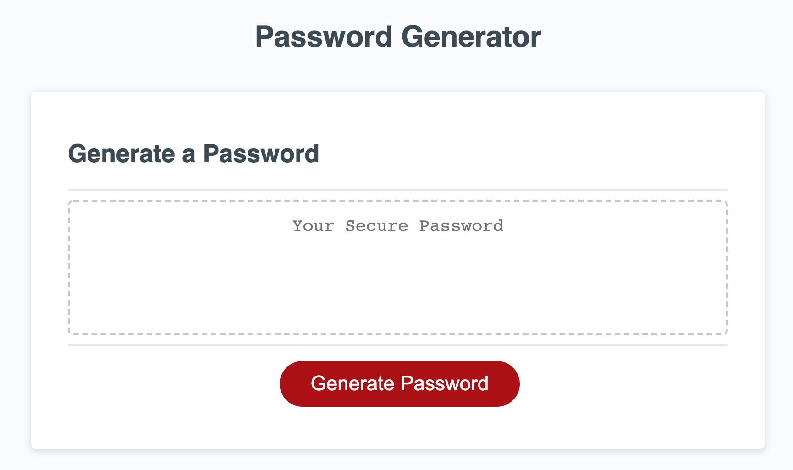
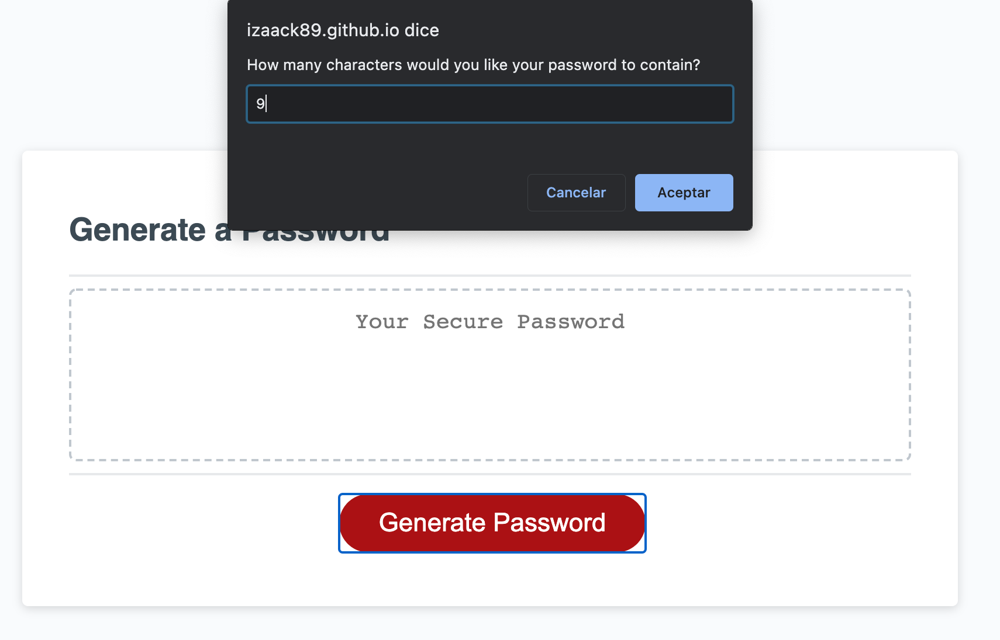
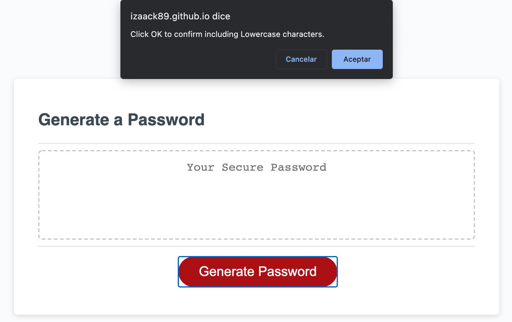
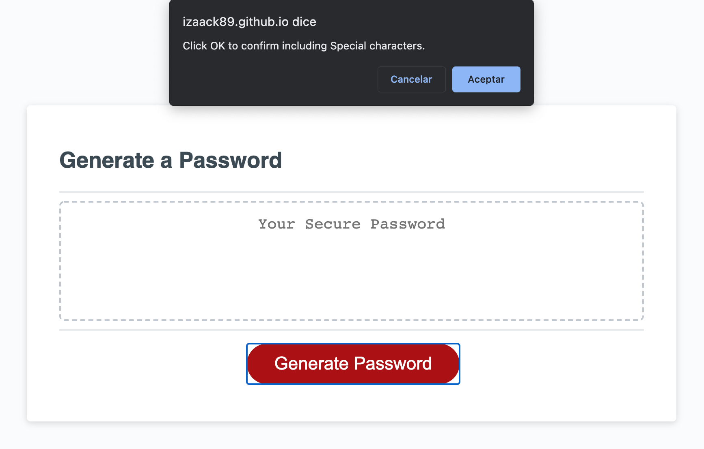
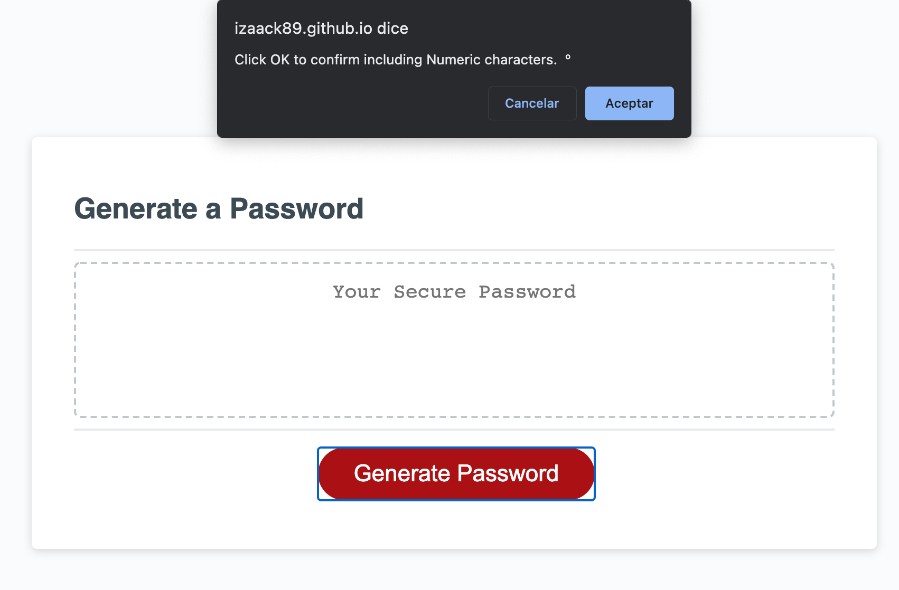
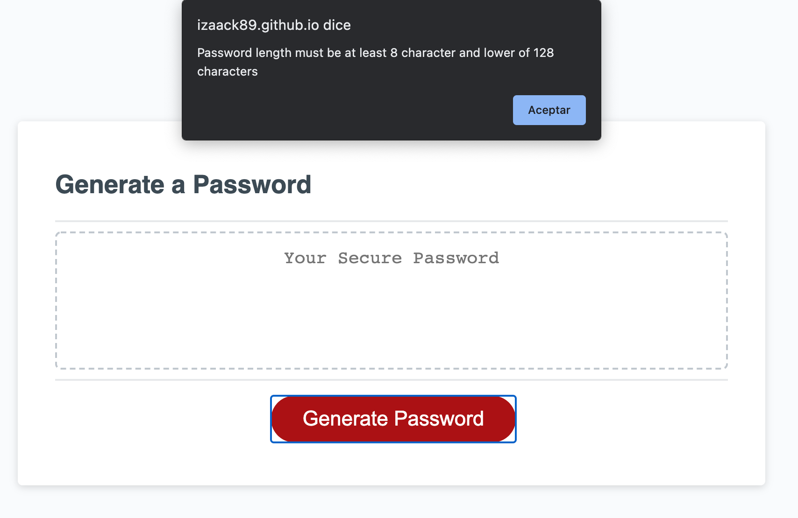
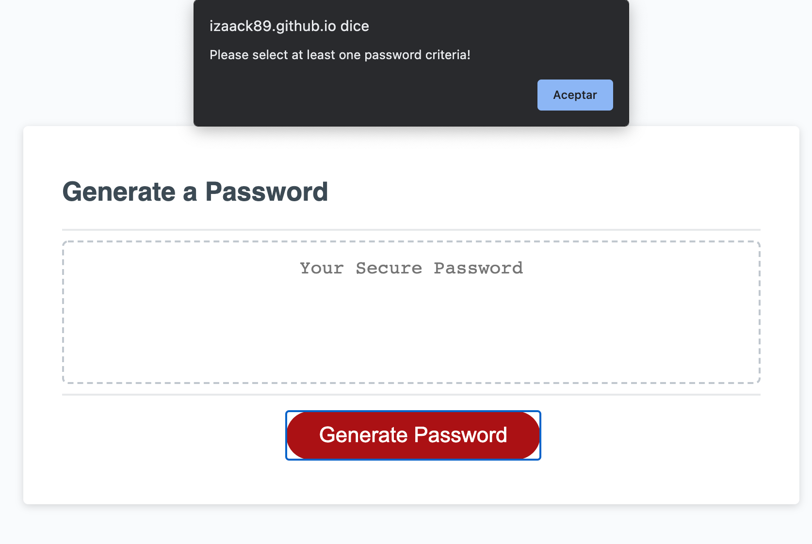

# 🔐 [Password Generator](https://izaack89.github.io/password-generator/)

The password Generator works according to the needs of the user so depening on some criterias the password can have lowercase,uppercase, special characters and/or numbers and the length also depend on the user so it can be from at least of 8 characters or lower of 128 characters. With this conditions the password will be very strong

## Using the system

The system in order to display a password it follow the next steps:

1. Enter the length that will be between 8 and 128 characters. Like the Follow image 
2. On this part of the system you can decide if you want that the password have lowercase characters 
3. On this part of the system you can decide if you want that the password have uppercase characters 
4. On this part of the system you can decide if you want that the password have special characters 
5. On this part of the system you can decide if you want that the password have numeric characters 
6. When all or any criteria is selected the system will display the password generated [Password](./readmeFiles/passwordResult.png)

## Errors Handlers

I added 3 features that will prevent that the system crash and are the follow:

1. When on the first step , if you set a length than is lower of 8 or greatest of 128 or if is null, the system will display this error and will show again the message until a valid lenght is enter
   

2. If none of the password criteria are selected the system will display this error and it will create a loop until one or more criterias are selected
   

3. Before to display the password I do a substr function in order to get the length that was enter by the beggining

## Password Generator References

- [sort](https://developer.mozilla.org/en-US/docs/Web/JavaScript/Reference/Global_Objects/Array/sort) - sort Function
- [split](https://developer.mozilla.org/en-US/docs/Web/JavaScript/Reference/Global_Objects/String/split) - split Function
- [join](https://developer.mozilla.org/en-US/docs/Web/JavaScript/Reference/Global_Objects/Array/join) - join Function
- [random](https://developer.mozilla.org/en-US/docs/Web/JavaScript/Reference/Global_Objects/Math/random) - random Function
- [charAt](https://developer.mozilla.org/en-US/docs/Web/JavaScript/Reference/Global_Objects/String/charAt) - chartAt Function
- [substr](https://developer.mozilla.org/en-US/docs/Web/JavaScript/Reference/Global_Objects/String/substr) - substr Function
- [Special Characters](https://owasp.org/www-community/password-special-characters) - Special Characters
- [ReadMe Markdowns](https://github.com/tchapi/markdown-cheatsheet/blob/master/README.md)

## Author

- **German Ramirez** - [GitHub](https://github.com/izaack89/)
